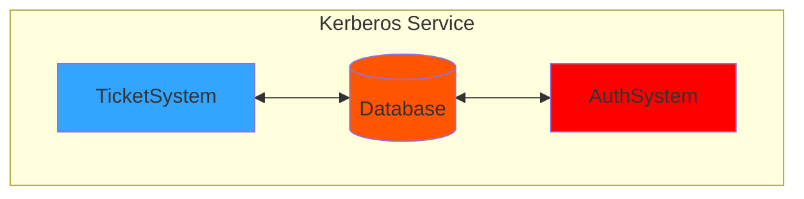
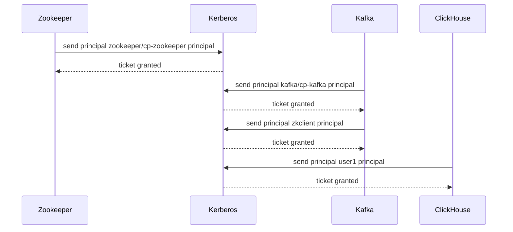

# How to configure a 'Kerberized' Kafka deployment for ClickHouse

This repo is related to the Altinity's blog article `How to configure a 'Kerberized' Kafka deployment for ClickHouse`. It provides all the build and configuration files used in the article, and can be used to test this deployment.

## Description of Kerberos deployment





## Structure

The `configs` folder contains a couple of subdirectories: 

- `secrets` is where the kafka, zookeeper, kerberos and exported keytabs for principals are generated during the startup of the `kdc-server` container. These files are exposed in different volumes for the different services. Check the `docker-compose.yaml` file to see the locations.
- `clickhouse.d` folder contains the kafka configuration for clickhouse service based on a named collection.


## KDC Server
This container is a simplified version of this [kerberos container](https://github.com/ist-dsi/docker-kerberos) provided by Simão Martins and David Duarte. It provides a standalone KDC server in a docker container, exposing default KDC ports: `749 TCP` and `88 UDP`. The default realm is `ALTINITY.TEST`. Additionally, a default KDC admin principal `kadmin/admin@ALTINITY.TEST` is created that may be used for KDC functionality testing such as `kadmin` commands.

### Starting

First build the image of the `kdc-server`:

```bash
docker build . -t altinity/kdc-server
```

From the container directory, use `docker-compose up -d` to start all services. If you need to start only the kerberos container just `docker-compose up -d kerberos` would do.

## Kafka usage

The `kdc-server` will be created using some ENV vars located in the `Dockerfile`. Change some of them accordingly to your settings, specially the docker network used (`altinity_default`) if you need to deploy the containers in other network.

The `init-script-kdc.sh` will create the basic kerberos service config files (`krb5.conf` and `kdc.conf`) set up some basic principals that will be used by the `zookeeper` and `kafka` services and export various keytabs that also will be used by both zookeeper/kafka and ClickHouse.

## General KDC Usage

Once the container started, switch into the container `docker exec -it kdc_server /bin/bash`, and use `kadmin.local` for the KDC amdmin interface. From there you can start adding principals and keytabs using `ktutil`

```bash
ktutil:  addent -password -p myusername@EXAMPLE.COM -k 1 -e RC4-HMAC
Password for myusername@EXAMPLE.COM:
ktutil:  wkt username.keytab
ktutil:  quit
```

After completing those steps there should be a keyfile created in the current directory. That keytab file can be used instead of using a password. For example:

```bash
/usr/bin/kinit myusername@EXAMPLE.COM -k -t /root/username.keytab
```

## Sources

- https://docs.docker.com/config/containers/container-networking/
- https://ubuntu.com/server/docs/service-kerberos
- https://github.com/confluentinc/cp-demo/blob/7.3.0-post/docker-compose.yml
- https://cwiki.apache.org/confluence/display/ZOOKEEPER/Client-Server+mutual+authentication
- https://docs.confluent.io/platform/current/installation/docker/config-reference.html#docker-configuration-parameters-for-cp
- https://docs.confluent.io/platform/current/kafka/overview-authentication-methods.html#authentication-methods-overview
- https://github.com/ClickHouse/ClickHouse/tree/master/tests/integration/test_storage_kerberized_kafka
- https://github.com/confluentinc/librdkafka/wiki/Using-SASL-with-librdkafka